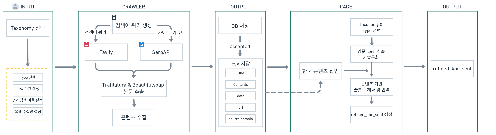

## 1. 레포지토리 설명

| | |
|---|---|
| 연관 프로젝트 | [텍소노미에 필요한 원천 문서를 자동으로 수집하는 기술](https://app.notion.com/p/3b4f7db422828007b5d1c30f8dbb5b77?source=copy_link) |
| 담당자 | 노은솔 |
| 작성일 | 2026-09-01 |

한국의 커뮤니티/뉴스/전문 매체 사이트를 대상으로, AI Safety Risk Taxonomy(LV1/LV2/type 3단 분류 체계, 6두품 19종 taxonomy)에 속하는 실제 사례 콘텐츠를 수집하는 파이프라인이다.

**전체 흐름**
1. 텍소노미 기준으로 Tavily/SerpAPI 두 검색 프로바이더로 후보 URL 탐색
2. 사이트별 파서 또는 범용 추출기로 본문 추출
3. 블랙리스트/중복/기간/한국어 비율/LLM taxonomy 적합성 필터링
4. 최종 통과 콘텐츠만 `data/final/[LV2]/[type].csv`로 내보내기

Streamlit UI(`app.py`)에서 **수집 설정 → 도메인 설정 → 검색어 검토 → 실행 및 결과 → 데이터 탐색 → 퀄리티 체크** 6단계로 전체 과정을 조작한다.

## 2. 데이터셋

- **원본 출처**: `configs/type_domains.yaml`에 taxonomy type별로 등록된 한국 뉴스·커뮤니티·전문 매체 도메인(예: newsis.com, hani.co.kr, gall.dcinside.com, lawtalk.co.kr 등)에서 SerpAPI/Tavily 검색으로 찾은 실제 게시글.
- **제작 방법**: 검색 → 본문 추출(trafilatura 또는 사이트 전용 파서) → 블랙리스트/중복/기간/한국어 비율 필터 → (OpenAI 기반 taxonomy 적합성 판단)(`prompts/taxonomy_filtering.yaml`)을 통과한 건만 채택.

**스키마** (CSV 컬럼, `src/storage/csv_exporter.py:CSV_COLUMNS`)

| 컬럼 | 설명 |
|---|---|
| title | 게시글 제목 |
| content | 정제된 본문 텍스트 |
| date | 게시일(YYYY-MM-DD), 못 찾으면 해당 건 자체를 저장하지 않음 |
| url | 정규화된 원문 URL |
| source_domain | 수집 도메인 |

저장 위치: `data/final/{lv2_id}/{type_name}.csv` (LV2·type 조합별 파일 1개)

## 3. 구체적인 설명

### 3.1 검색어 생성 (`src/query/`)
- `generator.py`가 taxonomy type의 정의/설명/include·exclude 기준을 바탕으로 OpenAI(`configs/providers.yaml`의 `query_generation_model`, structured output)로 Tavily/SerpAPI용 검색어를 미리 생성해 DB(`search_queries` 테이블)에 저장한다.
- `vocabulary.py`가 최신 실사용 표현(신조어·은어)을 다음 순서로 확보한다:
  1. DB 캐시(`fresh_vocabulary_cache`)
  2. 없으면 `freshness.py`(OpenAI Responses API + `web_search` 툴, `prompts/fresh_vocabulary.yaml`)로 웹 검색
  3. 정적 vocabulary도 없으면 definition/include_criteria에서 짧은 용어 추출
  4. 그마저 없으면 LV2 fallback vocabulary로 대체
- `year_injection.py`는 특정 (LV2, type, provider) 조합에서 기간 밖(date_out_of_range) 탈락률이 높으면 상대적 날짜 표현 대신 구체적인 연도를 검색어에 덧붙인다.

### 3.2 Discovery (`src/discovery/`)
- `scheduler.py`가 type/LV2별 목표 수집량에 맞춰 SerpAPI(도메인 3개씩 묶은 `site:` 검색, `domain_bundling.py`)와 Tavily(도메인 블랙리스트 제외) 검색을 번갈아 호출해 후보 URL을 쌓는다.
- 같은 검색어+도메인 조합(fingerprint)은 캐시해서 재호출하지 않는다.
- `adaptive_multiplier.py`는 고정 `candidate_multiplier` 대신 (LV2,type,provider) → (LV2,provider) → (provider) → config 기본값 순으로 실측 생존율(accepted/total)을 찾아 프로바이더별 배수를 동적으로 계산한다.
- `scoring.py`는 검색어/도메인의 과거 성과(시간 감쇠 성공률, 연속 실패 페널티)로 다음 시도 순서를 정하되, epsilon-greedy(기본 0.2)로 낮은 점수도 가끔 재시도해 기아 상태를 막는다.
- `retry_candidates.py`는 일시적 오류(timeout, 5xx, 본문 too-short 등 `retry_mode=immediate`)로 버려진 URL을 새 검색 API 호출 없이 재시도한다.

### 3.3 Extraction (`src/extraction/`)
- `parser_registry.py`가 도메인별 전용 파서(`cook82_parser.py`, `dcinside_parser.py`, `ruliweb_parser.py`, `instiz_parser.py`, `kin_parser.py`)를 우선 적용하고, 등록되지 않은 도메인은 `general_extractor.py`(trafilatura)로 처리한다.
- 제목이 없거나 본문이 `min_content_length` 미만이면 실패 처리한다.
- `cleaner.py`가 5개 사이트 파서에 중복돼 있던 정제 로직(메뉴 노이즈 상단 라인, 사이트별 푸터 마커, 중복 문단 제거)을 공통화한다.
- `duplicates.py`는 URL/content-hash 완전 중복 외에, 제목 n-gram 코사인 + 본문 word-Jaccard 유사도로 근접 중복을 탐지한다 — 현재는 shadow 모드로 임계값 미만 매치도 `near_duplicate_observations`에 기록만 하고(사람 라벨링 100쌍으로 임계값 보정 예정), 실제 탈락 처리는 아직 안 한다.

### 3.4 Filtering (`src/filtering/pipeline.py`)
비용이 싼 규칙 기반 필터(블랙리스트 → 기간 → 한국어 비율)를 먼저 통과해야 비싼 LLM 기반 필터(OpenAI taxonomy 적합성 판단)를 호출한다. 앞 단계에서 탈락하면 뒷 단계는 아예 실행하지 않는다(비용 절감). 중복 판정은 이 체인이 아니라 수집 시점(`src/pipeline/collector.py`의 `_finalize_candidate`)에서 처리된다.

## 4. 파이프라인 설명 및 실행



### 4.1 Streamlit UI 흐름
별도 `.py`/`.sh` 배치 스크립트는 없고, `app.py` 실행 시 6개 페이지가 순서대로 뜬다.

| 단계 | 페이지 | 내용 |
|---|---|---|
| 1 | 수집 설정 | LV2/type·목표 수집량·기간 지정 |
| 2 | 도메인 설정 | `type_domains.yaml`의 SerpAPI 허용 도메인 편집 |
| 3 | 검색어 검토 | 자동 생성된 검색어 확인/재생성 |
| 4 | 실행 및 결과 | `run_preflight()`로 사전 점검 → `run_collection()`으로 실제 API 호출·수집·필터링 → `export_run()`으로 CSV 반영 |
| 5 | 데이터 탐색 | 누적된 `data/final/` CSV 조회 |
| 6 | 퀄리티 체크 | `data/` 아래 CSV를 골라 `prompts/quality_score.yaml` 기준(사례 구체성/본문 품질/taxonomy 관련성/한국 관련성 1~5점)으로 OpenAI 채점 → 결과 다운로드(비용 경고 표시, `src/quality_check.py`) |

실제 수집(API 호출)은 "4. 실행 및 결과" 화면에서 버튼을 눌러야만 시작된다 — 사전 점검 단계에서 API 키 누락, 검색어 없음, 도메인 없음 등을 미리 경고해 크레딧 낭비를 막는다.

### 4.2 실행

실행 전 `.env`에 `OPENAI_API_KEY`, `TAVILY_API_KEY`, `SERPAPI_KEY`를 채워야 한다(`.env.example` 참고).

**UI로 실행** — 화면에서 설정을 조정하며 직접 수집

```bash
streamlit run app.py
```

UI에서 조정하는 주요 인자:

| 인자 | 설명 |
|---|---|
| 목표 수집량 / candidate_multiplier | `configs/collection.yaml` 기본값을 화면에서 덮어씀(LV2 기준 목표를 하위 type이 나눠 가짐). `adaptive_multiplier` 사용 시 이 값은 초기값/상한일 뿐, 실제 배수는 실측 생존율로 매 실행마다 재계산 |
| 수집 기간(date_from/date_to) | 화면 1번에서 지정, 게시일 필터에 그대로 쓰임 |
| taxonomy 적합성 LLM 필터 on/off | 끄면 규칙 기반 필터만 통과해도 채택됨(속도/비용 우선 시) |
| 도메인 목록 | 화면 2번에서 type별 SerpAPI 허용 도메인을 추가/삭제(`type_domains.yaml` 갱신) |

**CLI로 실행** (`experiments/`) — LV2별로 목표 수집량만큼 돌려서 성능(목표달성률·최종채택률)/비용(OpenAI 비용)/시간/콘텐츠 품질/사람 라벨 대비 taxonomy 정밀도를 한 번에 비교하는 정량 평가 워크플로. taxonomy LLM 필터는 강제로 꺼서 돌리고(채택 여부와 품질 평가를 분리), 품질은 별도 채점으로 사후 측정한다.

```bash
python -m experiments.run_experiment --target-count <N> --confirm  # 전체 19개 LV2 순회 수집, LV2당 목표 <N>건
python -m experiments.score_quality --confirm                      # accepted 콘텐츠 품질 채점
python -m experiments.build_report                                 # report.md/csv 생성
```

선택:
- `python -m experiments.labeling sample`로 LV2당 30건을 사람 라벨링용 CSV로 뽑고, 채운 뒤 `python -m experiments.labeling import`로 반영하면 report의 "Taxonomy정밀도"가 채워진다(라벨링 전에는 "미라벨링"으로 표시됨).
- `experiments/human_baseline.csv`를 채우면 report에 사람 수동 수집 대비 소요시간 비교 표가 추가된다.

결과: `experiments/report.md`(요약 + 26개 컬럼 상세 표), `report.csv`, `report_failure_reasons.csv`

## 5. 이슈

- 사이트 본문 추출 가능 여부는 반드시 실제 게시글 URL로 확인해야 한다 — 홈페이지/피드만 보고 판단하면 SPA로 오판하기 쉽다(예: lawtalk.co.kr, velog.io는 목록/홈만 클라이언트 렌더링이고 개별 게시글 상세는 서버 렌더링이라 정상 추출됨).
- 일부 사이트(`ppomppu.co.kr`, `bemil.chosun.com`)는 EUC-KR 인코딩을 쓴다 — `src/extraction/fetcher.py`에서 `Content-Type`에 charset이 없으면 `apparent_encoding`(chardet 기반)으로 자동 감지하도록 이미 처리돼 있으나, 이 두 도메인 실제 게시글에서 정상 동작하는지는 별도 확인 필요.
- Playwright/Firecrawl 등 JS 렌더링 수단은 구현돼 있지 않다(설정 토글로 꺼둔 게 아니라 애초에 미구현) — 정적 렌더링이 안 되는 도메인은 실질적으로 수집 불가(SerpAPI 크레딧만 소모하고 저장 0건).
- `configs/type_domains.yaml`과 `configs/blacklist.yaml`은 서로 겹치는 도메인이 없어야 하며(`src/config/validator.py`의 `_validate_domain_overlap`으로 검증), 새 도메인 추가 전 robots.txt + 실제 게시글 정적 렌더링 여부를 실측하고 반영해야 한다.
- `src/extraction/duplicates.py`의 근접 중복 판정(제목 n-gram 코사인, 본문 word-Jaccard)은 `configs/collection.yaml`의 `near_duplicate_detection.mode`로 shadow/enforce 전환이 가능하나, 기본값은 여전히 shadow다 — 사람 라벨 100쌍으로 보정하기 전까지는 `near_duplicate_observations`에 기록만 하고 실제로 걸러내지는 않는다.
- `configs/taxonomy.yaml`의 type별 `search_vocabulary`/`collection_exclude_criteria`/`query_axes`는 대부분 `1_C_Self_Harm`에만 채워져 있다. `Misinformation_and_Disinformation`(`rumors` type)에 `search_vocabulary`가 일부 추가됐지만 `collection_exclude_criteria`/`query_axes`는 아직 없고, 그 외 LV2는 legacy 필드(`exclude_criteria`)와 definition 기반 자동 추출 fallback으로 검색어를 생성한다.
- 사이트별 파서가 댓글을 실제로 긁어오는 로직은 아직 구현돼 있지 않다(`configs/extraction.yaml` 주석 참고).

## 6. Requirements

```
pyyaml
python-dotenv
pytest
openai
streamlit
tavily-python
serpapi
requests
trafilatura
beautifulsoup4
```

```bash
pip install -r requirements.txt
```

## 7. 폴더 구조

```
.
├── app.py                          # Streamlit 진입점 (페이지 네비게이션만 담당)
├── requirements.txt
├── .env.example
├── configs/                        # 앱 전역/수집/추출/재시도/taxonomy 등 YAML 설정
│   ├── app.yaml
│   ├── blacklist.yaml
│   ├── collection.yaml
│   ├── domain_aliases.yaml
│   ├── extraction.yaml
│   ├── logging.yaml
│   ├── providers.yaml
│   ├── retry_policy.yaml
│   ├── taxonomy.yaml               # 19개 LV2 / 75개 type 전체 정의
│   └── type_domains.yaml
├── prompts/                        # OpenAI 프롬프트 템플릿
│   ├── fresh_vocabulary.yaml       # 최신 실사용 표현 웹 검색용
│   ├── korea_relevance.yaml
│   ├── quality_score.yaml          # 콘텐츠 품질 채점(퀄리티 체크/experiments)
│   ├── query_generation.yaml
│   └── taxonomy_filtering.yaml
├── src/
│   ├── config/                     # 설정 로딩·검증
│   ├── query/                      # 검색어 생성 (generator, freshness, vocabulary, year_injection)
│   ├── discovery/                  # SerpAPI/Tavily 검색, 스케줄러, adaptive_multiplier, scoring, retry_candidates
│   ├── extraction/                 # 사이트별 파서 + 범용 추출기(trafilatura) + cleaner/comments/duplicates
│   ├── filtering/                  # 블랙리스트/중복/기간/한국어 비율/taxonomy 필터 체인
│   ├── pipeline/                   # 후보 처리·사전 점검(preflight)·수집 실행
│   ├── storage/                    # SQLite 저장소, CSV export, repositories/
│   ├── utils/                      # URL 정규화, rate limit, quota 분류, 유사도 계산
│   └── quality_check.py            # CSV/DB 콘텐츠 품질 채점 (UI 6번 페이지가 사용)
├── ui/
│   ├── common.py
│   ├── components/
│   └── pages/                      # 1~6단계 Streamlit 페이지 (quality_check 포함)
├── experiments/                    # 정량 평가 CLI (run_experiment → score_quality → build_report, labeling)
├── database/                       # SQLite DB (content.db)
├── data/
│   └── final/{LV2}/{type}.csv      # 최종 수집 결과
└── tests/                          # pytest 단위 테스트
```
</content>
